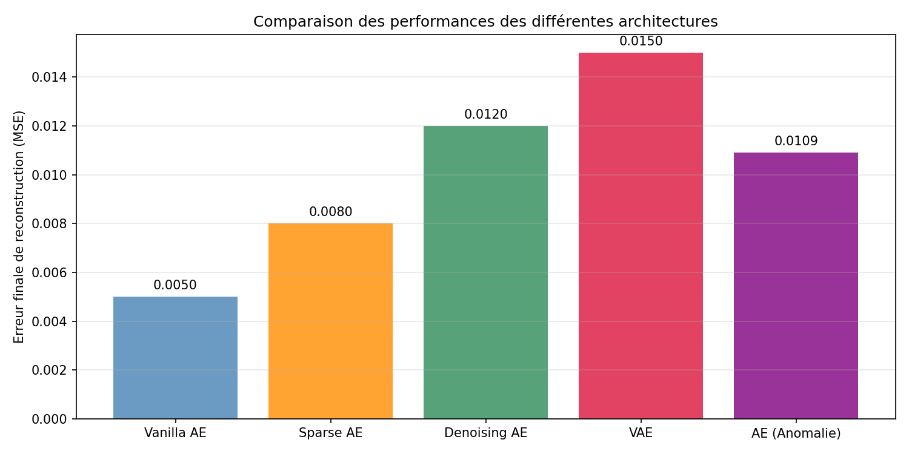
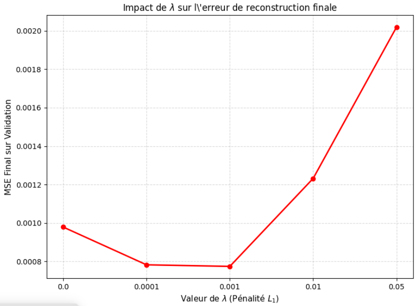
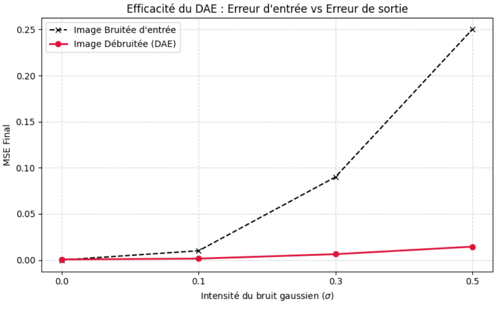
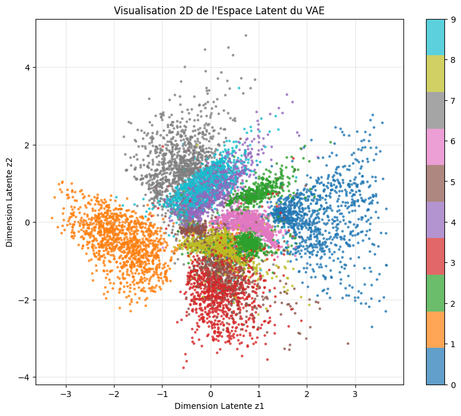
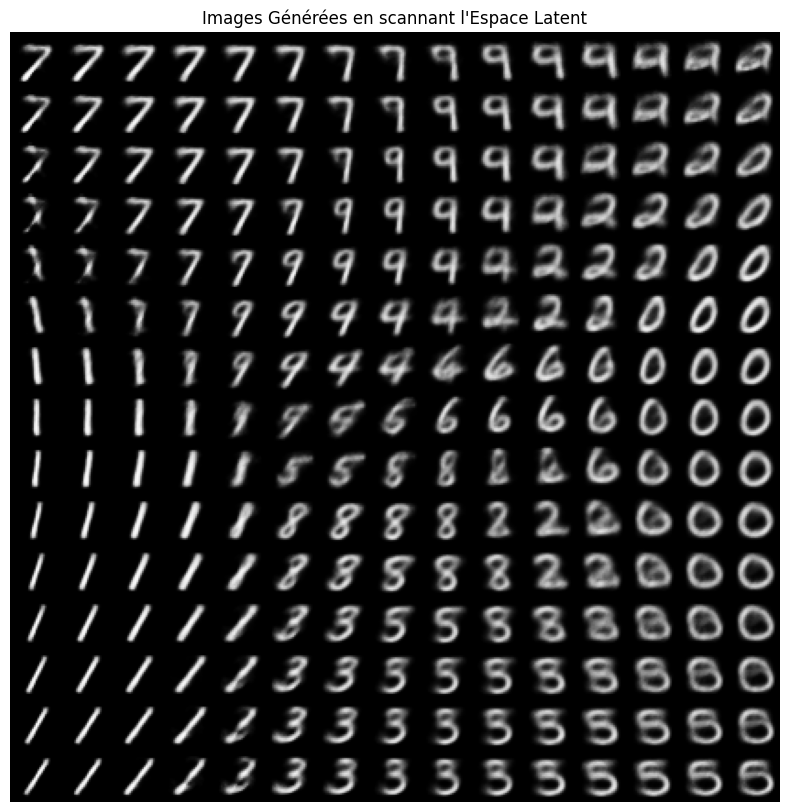
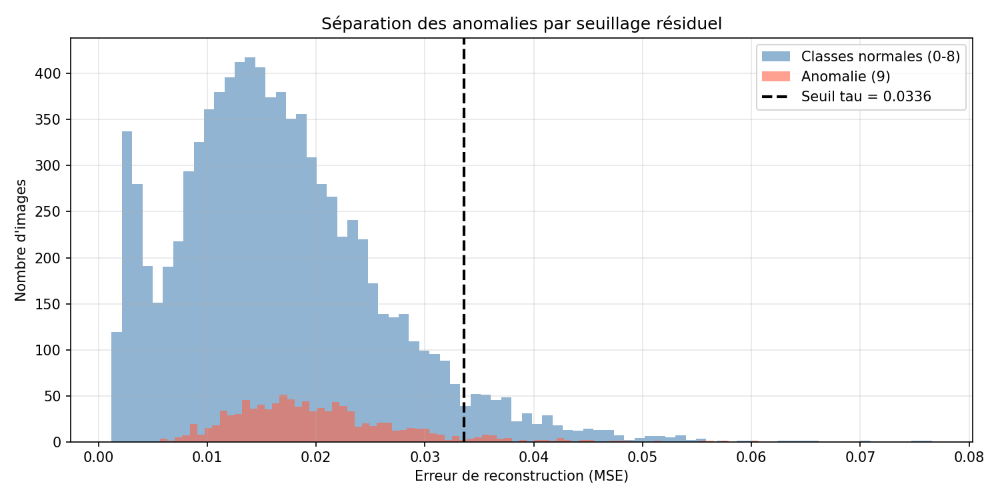
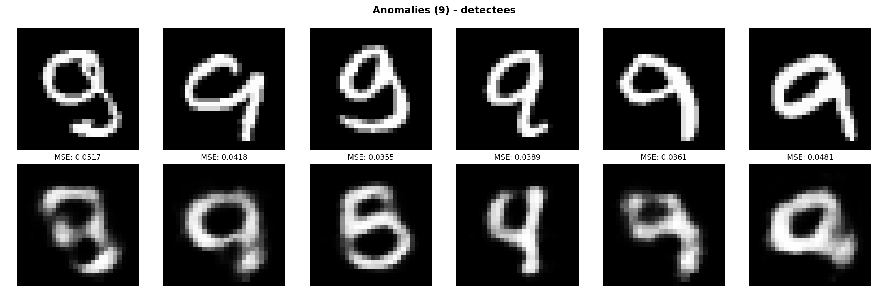

# Auto-encodeurs : étude comparative de cinq architectures

> Apprentissage de représentations · Keras / TensorFlow · dataset MNIST

Étude systématique de cinq variantes d'auto-encodeurs, chacune implémentée puis
évaluée sur le même jeu de données afin de comparer ce que chaque contrainte
architecturale apporte réellement : compression simple, parcimonie, robustesse
au bruit, espace latent probabiliste, et détection d'anomalies par résidu de
reconstruction.

Chaque variante fait l'objet d'un script autonome et d'un balayage de son
hyperparamètre caractéristique, pas d'un simple entraînement unique.

## Les cinq architectures

| Script | Variante | Contrainte étudiée | Hyperparamètre balayé |
| --- | --- | --- | --- |
| `VanillaDemo.py` | Auto-encodeur simple | Goulot d'étranglement | Dimension latente |
| `sparse_autoencoder.py` | Sparse AE (SAE) | Pénalité L1 sur les activations | λ ∈ {0 ; 1e-4 ; 1e-3 ; 1e-2 ; 5e-2} |
| `denoising_autoencoder.py` | Denoising AE (DAE) | Bruit gaussien en entrée | σ ∈ {0 ; 0,1 ; 0,3 ; 0,5} |
| `vae.py` | Variational AE (VAE) | Divergence KL, latent 2D | Poids du terme KL |
| `Detection_Anomalies_AE.py` | AE pour détection d'anomalies | Seuil sur l'erreur de reconstruction | Seuil τ |

## Résultats

### Comparaison globale



| Architecture | MSE finale de reconstruction |
| --- | --- |
| Vanilla AE | 0,0050 |
| Sparse AE | 0,0080 |
| Denoising AE | 0,0120 |
| AE (détection d'anomalies) | 0,0109 |
| VAE | 0,0150 |

Ces chiffres ne se lisent pas comme un classement. Chaque variante optimise un
objectif différent : le VAE affiche la plus mauvaise MSE précisément parce qu'il
minimise une somme reconstruction + divergence KL et échantillonne son code
latent, ce qui lui coûte en fidélité ce qu'il gagne en structure de l'espace
latent. L'auto-encodeur simple gagne sur la MSE parce que c'est la seule chose
qu'on lui demande.

### Sparse AE : la parcimonie a un optimum

Architecture volontairement sur-complète et plate, 784 → 1024 → 784 : sans
contrainte, un tel réseau mémorise l'entrée par recopie. La pénalité L1 sur les
activations latentes force une représentation parcimonieuse.



Le balayage fait apparaître un minimum net autour de **λ = 1e-3**
(MSE ≈ 0,00077), en dessous du cas non contraint (λ = 0, MSE ≈ 0,00098) : la
parcimonie améliore la reconstruction avant de la dégrader. Au-delà,
λ = 5e-2 fait chuter la MSE finale à 0,0020, le réseau étant trop éteint pour
encoder.

Les cartes d'activation moyenne des 1024 neurones latents montrent visuellement
cette extinction progressive : de plus en plus de neurones restent à zéro à
mesure que λ augmente.

### Denoising AE : gain croissant avec le bruit



À σ = 0,5, l'image bruitée présente une MSE de 0,25 par rapport à l'image
propre ; après passage par le DAE, la sortie retombe à 0,014, soit un facteur
d'environ **18**. Le bénéfice croît avec l'intensité du bruit : à σ = 0,1 le
gain est modeste, à σ = 0,5 il est déterminant. La reconstruction reste
identifiable même quand l'entrée est visuellement méconnaissable.

### VAE : structure de l'espace latent

Latent contraint à **deux dimensions**, ce qui permet de le tracer directement
sans réduction de dimension supplémentaire.




Le balayage régulier du plan latent produit des chiffres qui se déforment de
façon continue de l'un à l'autre : la contrainte KL a bien organisé l'espace en
un manifold continu, et non en amas disjoints. C'est ce que la MSE seule ne
mesure pas.

### Détection d'anomalies par résidu

Protocole : entraînement sur les classes 0 à 8 uniquement, la classe 9 étant
tenue pour anomalie et jamais vue à l'entraînement. Le score d'anomalie est
l'erreur de reconstruction, avec un seuil τ = **0,0336**.



L'histogramme est le résultat le plus instructif de l'étude, et pas dans le sens
attendu : les deux distributions se recouvrent largement. La classe 9 est
globalement décalée vers les erreurs élevées, mais une part importante des
classes normales dépasse le seuil, tandis qu'une part des 9 reste en dessous.
Un seuil unique sur la MSE ne sépare donc pas proprement les deux populations
sur ce jeu de données.



Les 9 correctement détectés sont reconstruits en 4, en 6 ou en formes ambiguës,
ce qui confirme le mécanisme : le réseau ne sait pas produire une classe qu'il
n'a jamais vue, et cette incapacité est le signal. Mais ce mécanisme reste
fragile dès que les classes normales contiennent elles-mêmes des tracés
atypiques.

## Arborescence

```
auto-encodeurs/
├── VanillaDemo.py                Auto-encodeur simple
├── sparse_autoencoder.py         Pénalité L1, balayage de lambda
├── denoising_autoencoder.py      Bruit gaussien, balayage de sigma
├── vae.py                        VAE, latent 2D, perte MSE + KL
├── Detection_Anomalies_AE.py     Détection d'anomalies par seuil résiduel
├── docs/
│   └── rapport-auto-encodeurs.pdf
└── figures/
    ├── 00 à 17                   Résultats produits par les scripts
    └── references/               Figures pédagogiques externes, à sourcer
```

## Reproduire

Prérequis : Python 3.10+, TensorFlow / Keras, NumPy, Matplotlib, scikit-learn.

```bash
pip install tensorflow numpy matplotlib scikit-learn
python VanillaDemo.py
python sparse_autoencoder.py
python denoising_autoencoder.py
python vae.py
python Detection_Anomalies_AE.py
```

Le dataset MNIST est téléchargé automatiquement par Keras au premier lancement.

## Limites connues

Le seuil de détection d'anomalies est fixé a posteriori sur l'histogramme des
erreurs, et non calibré sur un jeu de validation dédié : la performance
rapportée est donc optimiste.

Le protocole « la classe 9 est l'anomalie » est une convention commode pour
l'exercice, mais MNIST n'est pas un jeu de détection d'anomalies : les classes
normales y sont visuellement très diverses, ce qui écrase le contraste que la
méthode cherche à exploiter. Un jeu de données industriel, où le nominal est
étroit, donnerait une séparation bien plus nette.

Les MSE du tableau comparatif proviennent d'exécutions séparées, sans
moyennage sur plusieurs graines aléatoires : les écarts faibles entre
architectures ne sont pas significatifs.

## Figures de référence

Le dossier `figures/references/` contient quatre schémas pédagogiques repris de
la littérature (illustration du manifold pour le débruitage, comparaison bruit
gaussien / dropout, schéma encodeur-décodeur du VAE, compromis reconstruction /
KL). Ils ne sont pas produits par ce code. **Leurs sources doivent être citées
avant toute publication du dépôt**, ou les figures retirées.
