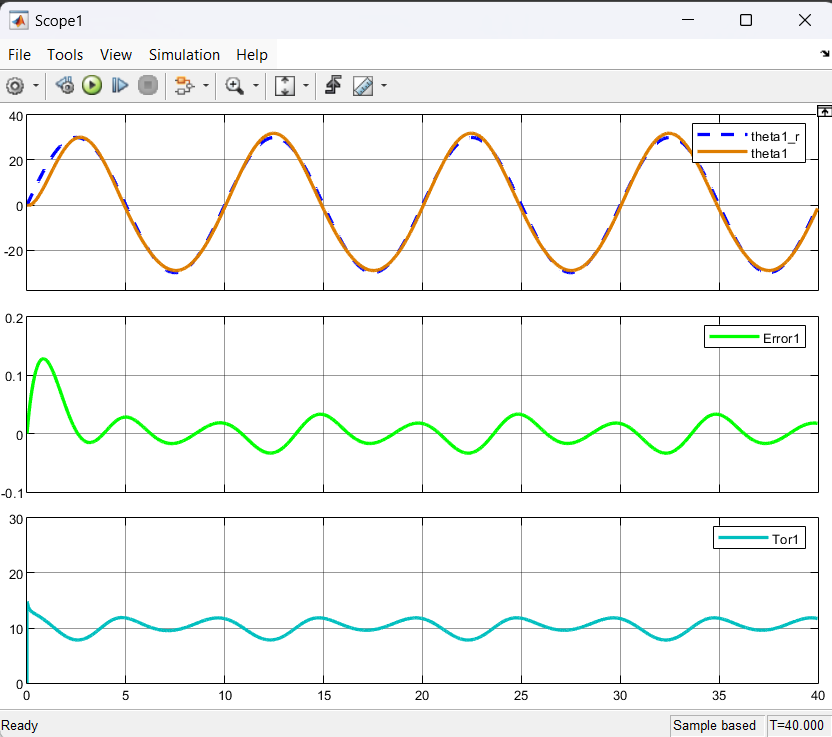
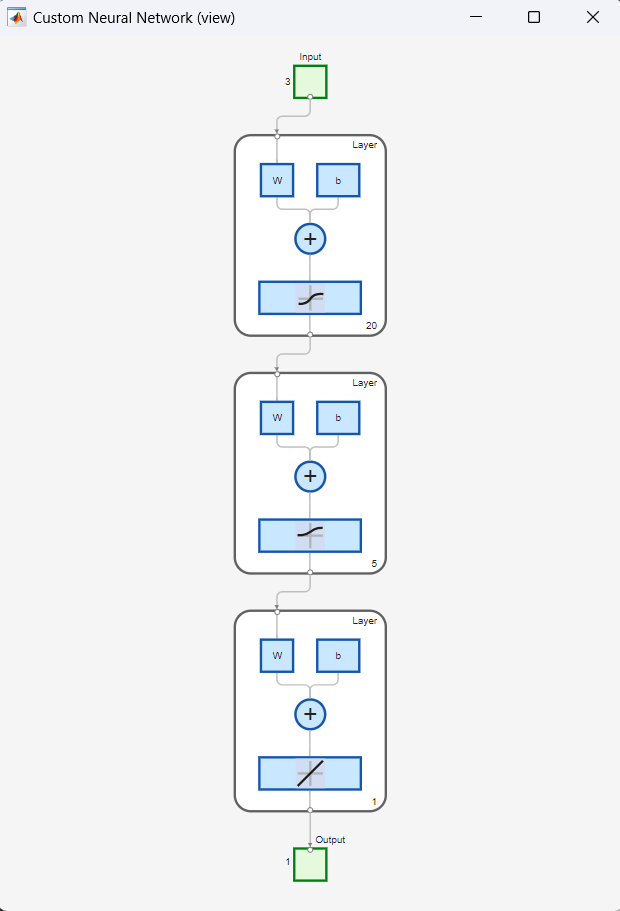

# Commande intelligente d'un bras manipulateur 2 DDL

> Comparaison de trois stratégies de commande intelligente · MATLAB / Simulink · article au format IEEE (EN)

La dynamique d'un bras à deux degrés de liberté est non linéaire et fortement
couplée entre axes : un correcteur réglé à la main atteint vite ses limites.
Ce travail compare trois stratégies de commande intelligente sur les mêmes
trajectoires de référence, avec le même modèle de bras, afin de mesurer ce que
chacune apporte réellement.

## Les trois stratégies

| Stratégie | Principe | Réglage |
| --- | --- | --- |
| PD flou (FLC) | Inférence de Mamdani, défuzzification par centroïde | 25 règles, deux entrées (erreur, dérivée) |
| Réseau de neurones (ANN) | MLP entraîné à approximer la loi floue, puis converti en bloc Simulink | Architecture 3-20-5-1, 4 001 échantillons, MSE cible 10⁻⁷ |
| PID optimisé par AG | Algorithme génétique sur les 6 gains PID | Population 20, jusqu'à 200 générations, élitisme, coût erreur + effort |

Le passage du contrôleur flou au réseau de neurones est le point intéressant du
travail : le MLP apprend la loi de commande floue hors ligne, puis la remplace
en tant que bloc Simulink unique, ce qui supprime le coût d'inférence des
25 règles à l'exécution tout en conservant le comportement.

## Résultats

### Suivi de trajectoire



Consigne sinusoïdale d'amplitude ±30° sur 40 s. Après le transitoire initial,
l'erreur de suivi de l'articulation 1 reste bornée à environ **±0,04 rad**, avec
un couple de commande oscillant autour de 11 N·m sans saturation ni
broutement. L'articulation 2 suit le même profil avec une erreur d'environ
±0,06 rad pour un couple moyen de 4 N·m.

L'erreur résiduelle est périodique et non aléatoire : elle suit la consigne, ce
qui est la signature d'un retard de phase, pas d'une instabilité.

### Réseau de neurones



MLP **3-20-5-1** : trois entrées, deux couches cachées à activation sigmoïde
(20 puis 5 neurones), sortie linéaire. Entraînement par RProp (`trainrp`) sur
4 001 échantillons générés à partir du contrôleur flou.

| Réseau | Époques | MSE finale | Régression |
| --- | --- | --- | --- |
| Articulation 1 | 65 898 | 3,86 · 10⁻⁶ | R = 1 |
| Articulation 2 | 1 055 | 9,28 · 10⁻⁷ | R = 0,99999 |
| Variante longue | 200 000 | 5,11 · 10⁻⁶ | R = 1 |

Le résultat le plus parlant du tableau n'est pas la MSE atteinte mais l'écart
de coût : l'articulation 2 atteint une meilleure erreur en **1 055 époques**
quand l'articulation 1 en demande 65 898, et la variante poussée à
200 000 époques finit moins bonne que celle arrêtée à 1 055. La cible de 10⁻⁷
n'est jamais atteinte, et continuer l'entraînement ne l'en rapproche pas :
le plancher vient de la structure du réseau, pas du nombre d'itérations.

### PID optimisé par algorithme génétique

Le **PID optimisé par algorithme génétique** est le plus précis, avec
K<sub>p1</sub> ≈ 85,7 et une erreur statique minimale. Le contrôleur flou est
plus robuste aux variations mais nettement plus lent, avec un temps de réponse
d'environ 5 s. Le réseau de neurones reproduit la loi floue à moindre coût de
calcul.

La fonction de coût de l'algorithme génétique pénalise à la fois l'erreur de
suivi et l'effort de commande : sans ce second terme, l'optimiseur converge vers
des gains très élevés, précis en simulation mais inapplicables sur un
actionneur réel.

## Arborescence

```
commande-intelligente-2ddl/
├── models/
│   ├── robot_dynamics.m          Dynamique du bras, partagée par les trois stratégies
│   ├── flc/
│   │   ├── FuzzyPD.fis           Contrôleur flou PD (25 règles)
│   │   ├── FUZZY_ROBOT_ARM_3.fis Variante du jeu de règles
│   │   ├── makeFuzzyPD.m         Construction programmatique du FIS
│   │   └── FuzzyPD_2DOFRobot.slx Modèle Simulink en boucle fermée
│   ├── ann/
│   │   ├── training_data.m       Génération du jeu d'apprentissage
│   │   ├── Data_1.m / Data_2.m   Jeux par articulation
│   │   ├── testnet.m             Évaluation du réseau entraîné
│   │   ├── Joint_1.slx / Joint_2NN.slx / joint.slx
│   │   ├── NN_PD_2DOFRobot.slx   Boucle fermée avec le réseau en correcteur
│   │   └── NN2_NetworkInverse.slx
│   └── ga-pid/
│       ├── GA_PID_Main.m / main_GA.m   Scripts d'optimisation
│       ├── Init.m                       Initialisation de la population
│       ├── Encode_Decimal.m / Decode_Decimal.m
│       ├── Cross_Twopoint.m             Croisement à deux points
│       ├── Mutata_Uniform.m             Mutation uniforme
│       ├── select_Linear_Ranking.m      Sélection par rang linéaire
│       └── GA_PID_2DOF.slx              Modèle évalué par la fonction de coût
└── figures/
    ├── 01 à 02   Suivi de trajectoire par articulation
    ├── 03 à 09   Architecture, convergence et régression du réseau
    └── 10 à 12   Couples de commande
```

L'algorithme génétique est écrit à la main : encodage décimal, sélection par rang
linéaire, croisement à deux points et mutation uniforme sont des fonctions
séparées, sans recours à la Global Optimization Toolbox.

## Reproduire

Prérequis : MATLAB avec Fuzzy Logic Toolbox, Deep Learning Toolbox et Simulink.
L'algorithme génétique est implémenté à la main, la Global Optimization Toolbox
n'est pas nécessaire.

1. Ouvrir `models/flc/FuzzyPD.fis` et vérifier les fonctions d'appartenance,
   ou le régénérer avec `makeFuzzyPD.m`.
2. Générer le jeu d'apprentissage (`models/ann/training_data.m`), entraîner les
   réseaux, puis vérifier avec `testnet.m`.
3. Lancer l'optimisation génétique (`models/ga-pid/`) : compter plusieurs
   minutes pour 200 générations.
4. Simuler les trois contrôleurs sur les mêmes trajectoires et comparer les
   courbes de suivi.

## Limites connues

Les trois stratégies sont évaluées en simulation uniquement, sur le modèle
dynamique du bras : aucune validation sur banc réel, donc aucune prise en compte
des frottements secs, des jeux mécaniques ni de la quantification des capteurs.

Le réseau de neurones est entraîné à imiter le contrôleur flou, il n'apprend
donc pas une meilleure loi de commande : sa performance est bornée par celle du
flou, et son intérêt est le coût de calcul, pas la précision.

Les gains issus de l'algorithme génétique sont optimaux pour les trajectoires du
jeu de test. Leur généralisation à d'autres profils de mouvement n'a pas été
vérifiée.

La cible d'entraînement de 10⁻⁷ n'a été atteinte par aucun réseau. Les MSE
rapportées sont des erreurs d'apprentissage : aucun jeu de validation
indépendant n'a été tenu à l'écart, et le réseau imitant une loi déterministe,
le risque de sur-apprentissage est faible mais non mesuré.

## À compléter

L'article au format IEEE reste à déposer dans `docs/`. Les figures des fonctions
d'appartenance du contrôleur flou et de l'architecture Simulink du GA-PID sont
à exporter depuis MATLAB.

Deux points à vérifier avant publication : `GA_PID_Main.m` et `main_GA.m`
semblent faire double emploi, et `Joint_1.slx`, `Joint_2NN.slx` et `joint.slx`
coexistent sans nommage clair. Garder le fichier de référence et supprimer les
autres, ou les renommer explicitement.

Le nommage des figures a été déduit de leur contenu : vérifier que
`01-suivi-articulation-1` correspond bien à l'articulation 1 et non à
l'articulation 2.
