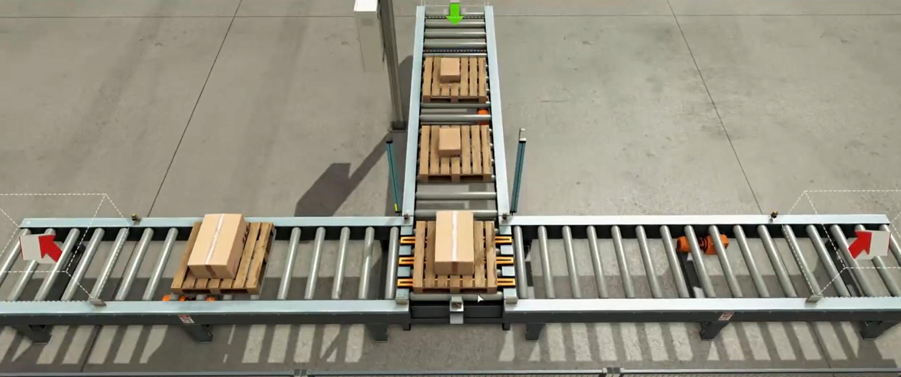
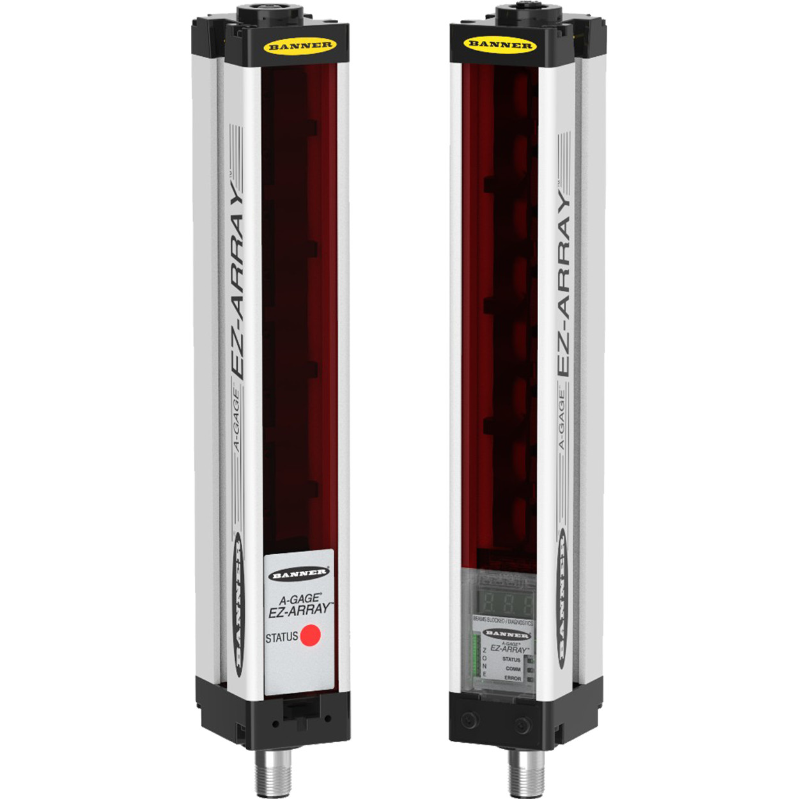

# Convoyeur de tri automatique par hauteur — S7-1200 & Factory I/O

> Automatisme industriel · ENSA Tanger, GSEA · TIA Portal V17
> Tri d'objets par hauteur sur jumeau numérique, automate Siemens S7-1200 en langage Ladder.

## Problème

Trier automatiquement des pièces selon leur hauteur sur une ligne de convoyage, avec les exigences d'une vraie cellule industrielle : modes de marche (Automatique / Manuel / Arrêt d'urgence), supervision du procédé, et validation sans matériel physique.

## Solution

- **Détection** : capteur *Light Array* (rideau de faisceaux parallèles) mesurant la hauteur de chaque pièce au passage.
- **Logique de tri** en Ladder sur **S7-1200** (TIA Portal) : aiguillage vers le coulissoir correspondant, gestion des 3 modes de marche, alerte si pièce non conforme.
- **Jumeau numérique** : scène **Factory I/O** pilotée par l'automate via le driver **OPC-DA** — la logique est validée sur le procédé virtuel exactement comme sur une ligne réelle.

## Contenu du dépôt

```
├── P1-01-Sorting-by-height.ap17   # Projet TIA Portal complet
├── Blockdiagram.pdf               # Schéma-bloc du système
├── captures/                      # Scène Factory I/O, drivers E/S, capteur
└── README.md
```

## Captures






## Utilisation

1. Ouvrir `P1-01-Sorting-by-height.ap17` dans **TIA Portal V17** (ou +).
2. Lancer la scène dans **Factory I/O** et sélectionner le driver OPC.
3. Démarrer la simulation de l'automate (PLCSIM) puis passer en mode Automatique.

## Environnement

`TIA Portal V17` · `Ladder (LAD)` · `Factory I/O` · `OPC-DA` · `S7-1200`

## Auteur

**AZONHOUMON H. Horacia Gloriéta** ([@HoraEmbedded](https://github.com/HoraEmbedded)) · [Portfolio](https://hora-portfolio.vercel.app/)
