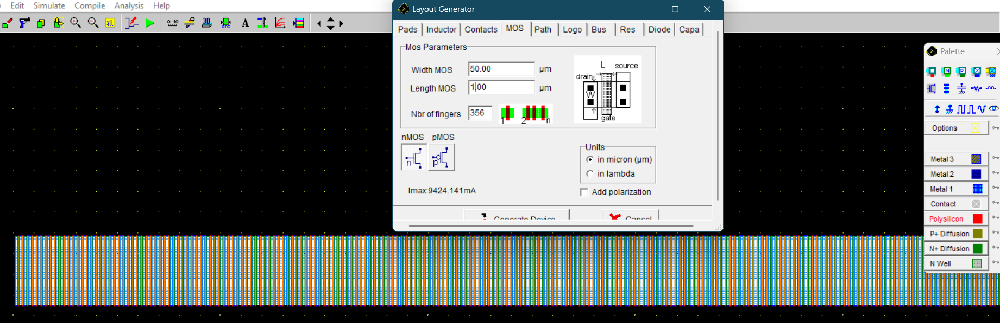
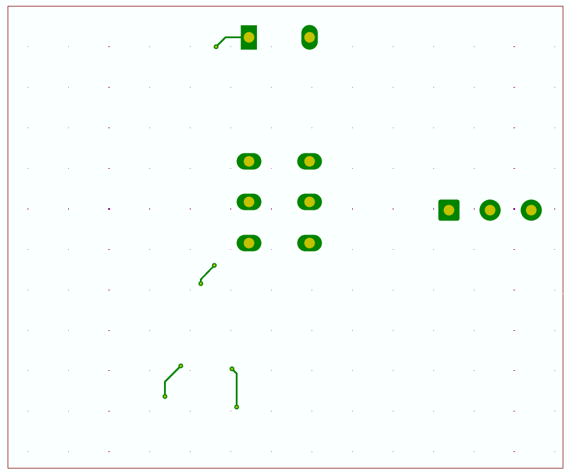
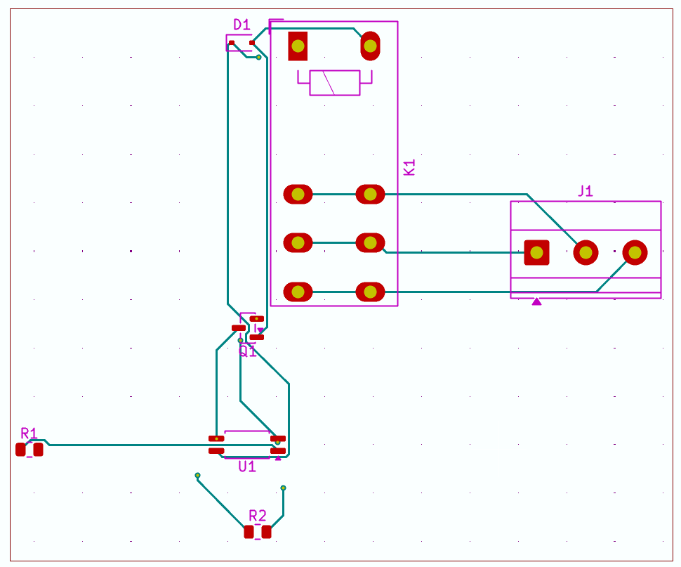
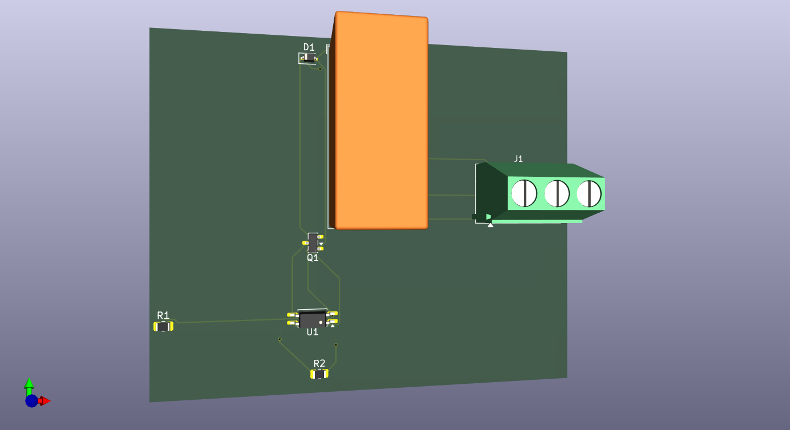

# Driver NMOS : commande isolée de 6 relais industriels, du schéma au silicium

> Bureau d'étude électronique · ENSA Tanger, GSEA · équipe de 5 · 2026

Interface de puissance permettant à un microcontrôleur limité à **3,3 V / 20 mA** de piloter **6 relais industriels RT424005** (bobine 5 V / 80 mA), avec isolation galvanique complète et protection contre les surtensions inductives.

---

## Problème

Un microcontrôleur ne peut pas piloter directement une bobine de relais :

- courant demandé (80 mA) très supérieur au courant max d'une broche (20 mA) ;
- niveaux logiques 3,3 V incompatibles avec la bobine 5 V ;
- à l'ouverture, la bobine génère une surtension inductive destructrice pour la sortie du µC.

## Solution

Chaîne de commande dimensionnée composant par composant :

| Fonction | Composant | Rôle |
|---|---|---|
| Commutation | NMOS **IRLML2502** (logic-level, CMS) | Ferme le circuit bobine, piloté par la grille |
| Roue libre | Diode **1N4148W** | Écrête la surtension inductive à l'ouverture |
| Isolation | Optocoupleur **LTV-817S** | Isolation galvanique **5 000 V rms** entre µC et puissance |

Démarche complète :

1. **Calculs** : résistances de grille et de LED d'optocoupleur, point de fonctionnement, dissipations thermiques.
2. **Simulation** : validation du canal sous **Proteus** et **PSpice** (régimes statique et de commutation).
3. **Industrialisation** : schéma et routage 6 canaux sous **KiCad** — 0 erreur DRC, fichiers **Gerber** exportés, nomenclature chiffrée **DigiKey** (~22 $ les 6 canaux).
4. **Silicium** : re-conception du transistor en technologie **ENSAT 0,8 µm** sous **Microwind** — layout en peigne de **356 doigts**, W/L ≈ 17 778.

## Résultats mesurés

| Grandeur | Valeur |
|---|---|
| Chute à l'état passant (80 mA) | **2,7 mV** (R_DS(on) ≈ 0,033 Ω) |
| Courant de fuite à l'état bloqué | **5 pA** |
| Isolation galvanique | **5 000 V rms** |
| Erreurs DRC au routage | **0** |
| Coût matière (6 canaux) | **≈ 22 $** |

## Aperçu

<!-- Remplacer par les vraies captures (dossier docs/) -->







## Structure du dépôt

```
├── schematics/        # Schémas (KiCad, Proteus)
├── pcb/               # Routage KiCad + fichiers Gerber
├── simulations/       # Fichiers PSpice / Proteus
├── silicon/           # Layout Microwind (ENSAT 0,8 µm)
├── docs/              # Rapport, captures, nomenclature DigiKey
└── README.md
```

## Outils

`KiCad` · `Proteus` · `PSpice` · `Microwind` · composants CMS

## Équipe

Projet mené en équipe de 5 : ENSA Tanger, filière GSEA.
Ma contribution : dimensionnement du canal de commande, simulations et routage.

---

*Voir aussi mon [portfolio](https://hora-portfolio.vercel.app/) et mes autres projets sur [github.com/HoraEmbedded](https://github.com/HoraEmbedded).*
